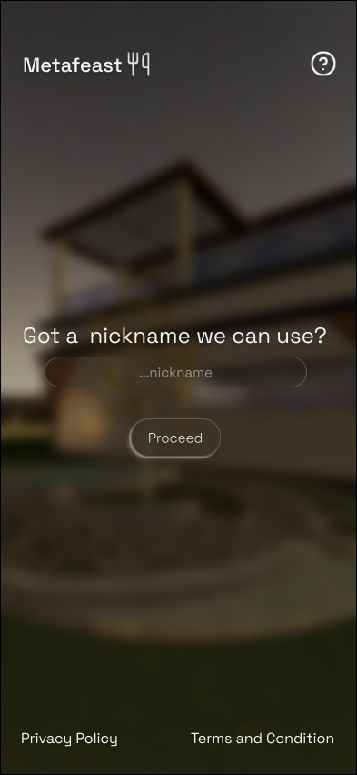
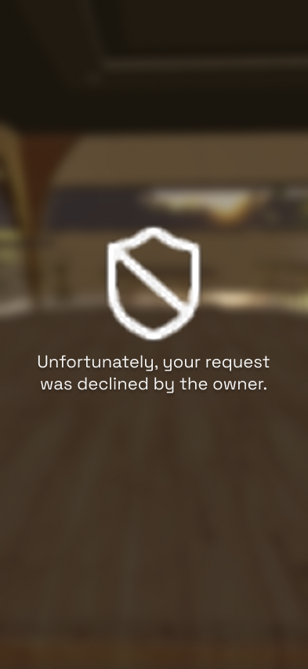
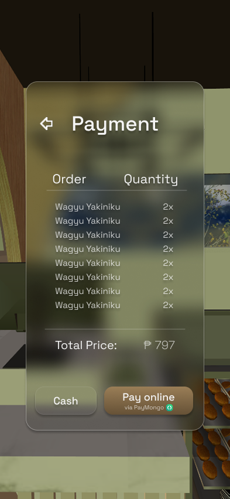

# Admin Design Figma

<table>
  <tr>
    <td width="50%">
      
<strong>Admin View Panel</strong>

      
    </td>
    <td width="50%">
      
<strong>Admin Table Request</strong>

      
    </td>
  </tr>
  <tr>
    <td>
      
<strong>Admin Notification</strong>

      
    </td>
    <td>
      
<strong>Admin Order Popup</strong>

      
    </td>
  </tr>
  <tr>
    <td>
      
<strong>Pending Payment</strong>

      
    </td>

  </tr>
</table>

---

# Customer Design Figma

<table>
  <tr>
    <td>
      
<strong>Get Name</strong>

      
    </td>
    <td>
      
<strong>Select Table</strong>

      
    </td>
    <td>
      
<strong>Confirm Table</strong>

      
    </td>
  </tr>

  <tr>
    <td>
      
<strong>Waiting for Table Request</strong>

      
    </td>
    <td>
      
<strong>Being Declined</strong>

      
    </td>
    <td>
      
<strong>Order Menu</strong>

      
    </td>
  </tr>

  <tr>
    <td>
      
<strong>Product Details</strong>

      
    </td>
    <td>
      
<strong>Order List</strong>

      
    </td>
    <td>
      
<strong>Order Confirmation</strong>

      
    </td>
    <td>
      
<strong>Order Waiting</strong>

      
    </td>
  </tr>

  <tr>
    <td>
      
<strong>Eating Phase</strong>

      
    </td>
    <td>
      
<strong>Costumer payment</strong>

      
    </td>
    <td>
      
<strong>Costumer waiting for payment confirmation</strong>

      
    </td>
  </tr>
 
    
  </tr>
    <td>
      
<strong>Confirmed payment</strong>

      
    </td>  
  </tr>
</table>
